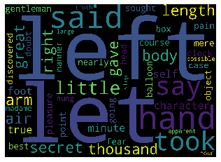

## Contents:
* [Loading Required Libraries](#first-bullet)
* [Loading Metadata Information](#second-bullet)
* [Fetching all the JSON Files](#third-bullet)
* [Helper Functions](#third-bullet)
* [Data Pre-Processing/Cleaning](#fourth-bullet)
* [Sentence Tokenization](#fifth-bullet)
* [Loading Flair & Elmo Contextual Biomedical Embeddings](#sixth-bullet)
* [Dimensionality Reduction with t-SNE](#seventh-bullet)
* [Create Clusters (K-Means) of Sentence Embeddings](#eigth-bullet)
* [Semantic Search](#ninth-bullet)
* [An End-To-End Closed Domain Question Answering System (CdQA)](#tenth-bullet)

**Loading Required Libraries**


```python
## General Utilities
import numpy as np # linear algebra
import pandas as pd # data processing, CSV file I/O (e.g. pd.read_csv)
import glob
import json
import re
import os
import warnings 
warnings.filterwarnings('ignore')

import matplotlib.pyplot as plt
plt.style.use('ggplot')

## Sklearn Utilities
from sklearn.decomposition import PCA
from sklearn.manifold import TSNE
from sklearn.metrics.pairwise import cosine_similarity

## Tqdm Utilities
from tqdm import tqdm_notebook, tnrange
from tqdm.auto import tqdm
tqdm.pandas(desc='Progress')

## Bokeh Utilities
from bokeh.models import ColumnDataSource, HoverTool, LinearColorMapper, CustomJS
from bokeh.palettes import Category20
from bokeh.transform import linear_cmap
from bokeh.io import output_file, show
from bokeh.transform import transform
from bokeh.io import output_notebook
from bokeh.plotting import figure
from bokeh.layouts import column
from bokeh.models import RadioButtonGroup
from bokeh.models import TextInput
from bokeh.layouts import gridplot
from bokeh.models import Div
from bokeh.models import Paragraph
from bokeh.layouts import column, widgetbox

## IPython Utilities
from IPython.display import HTML

import notebook as widgets
from ipywidgets import interact, interactive, fixed, interact_manual, interactive_output, VBox

from IPython.html import widgets
from IPython.display import display, Image, HTML, Markdown, clear_output
```


```python
## Install flair library
!pip install flair
```

    Collecting flair
      Downloading flair-0.4.5-py3-none-any.whl (136 kB)
         |████████████████████████████████| 136 kB 2.7 MB/s 
    [?25hRequirement already satisfied: gensim>=3.4.0 in /opt/conda/lib/python3.6/site-packages (from flair) (3.8.1)
    Requirement already satisfied: regex in /opt/conda/lib/python3.6/site-packages (from flair) (2020.2.20)
    Requirement already satisfied: urllib3<1.25,>=1.20 in /opt/conda/lib/python3.6/site-packages (from flair) (1.24.3)
    Requirement already satisfied: transformers>=2.3.0 in /opt/conda/lib/python3.6/site-packages (from flair) (2.5.1)
    Collecting pytest>=5.3.2
      Downloading pytest-5.4.1-py3-none-any.whl (246 kB)
         |████████████████████████████████| 246 kB 8.4 MB/s 
    [?25hRequirement already satisfied: matplotlib>=2.2.3 in /opt/conda/lib/python3.6/site-packages (from flair) (3.0.3)
    Requirement already satisfied: hyperopt>=0.1.1 in /opt/conda/lib/python3.6/site-packages (from flair) (0.2.3)
    Requirement already satisfied: python-dateutil>=2.6.1 in /opt/conda/lib/python3.6/site-packages (from flair) (2.8.0)
    Requirement already satisfied: mpld3==0.3 in /opt/conda/lib/python3.6/site-packages (from flair) (0.3)
    Requirement already satisfied: scikit-learn>=0.21.3 in /opt/conda/lib/python3.6/site-packages (from flair) (0.22.2.post1)
    Requirement already satisfied: torch>=1.1.0 in /opt/conda/lib/python3.6/site-packages (from flair) (1.4.0)
    Requirement already satisfied: deprecated>=1.2.4 in /opt/conda/lib/python3.6/site-packages (from flair) (1.2.7)
    Collecting sqlitedict>=1.6.0
      Downloading sqlitedict-1.6.0.tar.gz (29 kB)
    Collecting bpemb>=0.2.9
      Downloading bpemb-0.3.0-py3-none-any.whl (19 kB)
    Requirement already satisfied: langdetect in /opt/conda/lib/python3.6/site-packages (from flair) (1.0.7)
    Requirement already satisfied: tqdm>=4.26.0 in /opt/conda/lib/python3.6/site-packages (from flair) (4.42.0)
    Requirement already satisfied: tabulate in /opt/conda/lib/python3.6/site-packages/tabulate-0.8.6-py3.6.egg (from flair) (0.8.6)
    Collecting segtok>=1.5.7
      Downloading segtok-1.5.7.tar.gz (24 kB)
    Requirement already satisfied: numpy>=1.11.3 in /opt/conda/lib/python3.6/site-packages (from gensim>=3.4.0->flair) (1.18.1)
    Requirement already satisfied: smart-open>=1.8.1 in /opt/conda/lib/python3.6/site-packages (from gensim>=3.4.0->flair) (1.9.0)
    Requirement already satisfied: six>=1.5.0 in /opt/conda/lib/python3.6/site-packages (from gensim>=3.4.0->flair) (1.14.0)
    Requirement already satisfied: scipy>=0.18.1 in /opt/conda/lib/python3.6/site-packages (from gensim>=3.4.0->flair) (1.4.1)
    Requirement already satisfied: requests in /opt/conda/lib/python3.6/site-packages (from transformers>=2.3.0->flair) (2.22.0)
    Requirement already satisfied: sentencepiece in /opt/conda/lib/python3.6/site-packages (from transformers>=2.3.0->flair) (0.1.85)
    Requirement already satisfied: tokenizers==0.5.2 in /opt/conda/lib/python3.6/site-packages (from transformers>=2.3.0->flair) (0.5.2)
    Requirement already satisfied: boto3 in /opt/conda/lib/python3.6/site-packages (from transformers>=2.3.0->flair) (1.12.13)
    Requirement already satisfied: sacremoses in /opt/conda/lib/python3.6/site-packages (from transformers>=2.3.0->flair) (0.0.38)
    Requirement already satisfied: filelock in /opt/conda/lib/python3.6/site-packages (from transformers>=2.3.0->flair) (3.0.12)
    Requirement already satisfied: more-itertools>=4.0.0 in /opt/conda/lib/python3.6/site-packages (from pytest>=5.3.2->flair) (8.2.0)
    Requirement already satisfied: pluggy<1.0,>=0.12 in /opt/conda/lib/python3.6/site-packages (from pytest>=5.3.2->flair) (0.13.1)
    Requirement already satisfied: attrs>=17.4.0 in /opt/conda/lib/python3.6/site-packages (from pytest>=5.3.2->flair) (19.3.0)
    Requirement already satisfied: packaging in /opt/conda/lib/python3.6/site-packages (from pytest>=5.3.2->flair) (20.1)
    Requirement already satisfied: importlib-metadata>=0.12; python_version < "3.8" in /opt/conda/lib/python3.6/site-packages (from pytest>=5.3.2->flair) (1.5.0)
    Requirement already satisfied: py>=1.5.0 in /opt/conda/lib/python3.6/site-packages (from pytest>=5.3.2->flair) (1.8.1)
    Requirement already satisfied: wcwidth in /opt/conda/lib/python3.6/site-packages (from pytest>=5.3.2->flair) (0.1.8)
    Requirement already satisfied: cycler>=0.10 in /opt/conda/lib/python3.6/site-packages (from matplotlib>=2.2.3->flair) (0.10.0)
    Requirement already satisfied: kiwisolver>=1.0.1 in /opt/conda/lib/python3.6/site-packages (from matplotlib>=2.2.3->flair) (1.1.0)
    Requirement already satisfied: pyparsing!=2.0.4,!=2.1.2,!=2.1.6,>=2.0.1 in /opt/conda/lib/python3.6/site-packages (from matplotlib>=2.2.3->flair) (2.4.6)
    Collecting networkx==2.2
      Downloading networkx-2.2.zip (1.7 MB)
         |████████████████████████████████| 1.7 MB 8.6 MB/s 
    [?25hRequirement already satisfied: cloudpickle in /opt/conda/lib/python3.6/site-packages (from hyperopt>=0.1.1->flair) (1.3.0)
    Requirement already satisfied: future in /opt/conda/lib/python3.6/site-packages (from hyperopt>=0.1.1->flair) (0.18.2)
    Requirement already satisfied: joblib>=0.11 in /opt/conda/lib/python3.6/site-packages (from scikit-learn>=0.21.3->flair) (0.14.1)
    Requirement already satisfied: wrapt<2,>=1.10 in /opt/conda/lib/python3.6/site-packages (from deprecated>=1.2.4->flair) (1.11.2)
    Requirement already satisfied: boto>=2.32 in /opt/conda/lib/python3.6/site-packages (from smart-open>=1.8.1->gensim>=3.4.0->flair) (2.49.0)
    Requirement already satisfied: certifi>=2017.4.17 in /opt/conda/lib/python3.6/site-packages (from requests->transformers>=2.3.0->flair) (2019.11.28)
    Requirement already satisfied: chardet<3.1.0,>=3.0.2 in /opt/conda/lib/python3.6/site-packages (from requests->transformers>=2.3.0->flair) (3.0.4)
    Requirement already satisfied: idna<2.9,>=2.5 in /opt/conda/lib/python3.6/site-packages (from requests->transformers>=2.3.0->flair) (2.8)
    Requirement already satisfied: s3transfer<0.4.0,>=0.3.0 in /opt/conda/lib/python3.6/site-packages (from boto3->transformers>=2.3.0->flair) (0.3.3)
    Requirement already satisfied: jmespath<1.0.0,>=0.7.1 in /opt/conda/lib/python3.6/site-packages (from boto3->transformers>=2.3.0->flair) (0.9.5)
    Requirement already satisfied: botocore<1.16.0,>=1.15.13 in /opt/conda/lib/python3.6/site-packages (from boto3->transformers>=2.3.0->flair) (1.15.13)
    Requirement already satisfied: click in /opt/conda/lib/python3.6/site-packages (from sacremoses->transformers>=2.3.0->flair) (7.0)
    Requirement already satisfied: zipp>=0.5 in /opt/conda/lib/python3.6/site-packages (from importlib-metadata>=0.12; python_version < "3.8"->pytest>=5.3.2->flair) (2.2.0)
    Requirement already satisfied: setuptools in /opt/conda/lib/python3.6/site-packages (from kiwisolver>=1.0.1->matplotlib>=2.2.3->flair) (45.2.0.post20200210)
    Requirement already satisfied: decorator>=4.3.0 in /opt/conda/lib/python3.6/site-packages (from networkx==2.2->hyperopt>=0.1.1->flair) (4.4.1)
    Requirement already satisfied: docutils<0.16,>=0.10 in /opt/conda/lib/python3.6/site-packages (from botocore<1.16.0,>=1.15.13->boto3->transformers>=2.3.0->flair) (0.15.2)
    Building wheels for collected packages: sqlitedict, segtok, networkx
      Building wheel for sqlitedict (setup.py) ... [?25l- \ done
    [?25h  Created wheel for sqlitedict: filename=sqlitedict-1.6.0-py3-none-any.whl size=14688 sha256=3ea14b5e65c8fabe2ada18b4ac7d02a5e49873b4ab08b1cc4fd75c460a6c93cf
      Stored in directory: /root/.cache/pip/wheels/7d/44/14/5dc41bad7fa0e87462127d2beba1eaae0c180c98f1024a31db
      Building wheel for segtok (setup.py) ... [?25l- \ done
    [?25h  Created wheel for segtok: filename=segtok-1.5.7-py3-none-any.whl size=23257 sha256=e2a629f6265e021e0b293a16bfe08971db186aa46bc60ee47cd6330d6e4a2a9f
      Stored in directory: /root/.cache/pip/wheels/7e/95/de/e369cd635c8e212947acc86aa7d04673ea71708f4be4e36b7b
      Building wheel for networkx (setup.py) ... [?25l- \ | / - \ | / done
    [?25h  Created wheel for networkx: filename=networkx-2.2-py2.py3-none-any.whl size=1527322 sha256=f6184460917ef2ec49d43297b81be92e96525ac5f2950130a42a90940eecd592
      Stored in directory: /root/.cache/pip/wheels/0f/12/87/f2ce9e3aeb87e36bde305edc44e4877932b039491b97f96090
    Successfully built sqlitedict segtok networkx
    ERROR: pytest-astropy 0.8.0 requires pytest-filter-subpackage>=0.1, which is not installed.
    ERROR: osmnx 0.10 has requirement networkx>=2.3, but you'll have networkx 2.2 which is incompatible.
    ERROR: allennlp 0.9.0 has requirement spacy<2.2,>=2.1.0, but you'll have spacy 2.2.3 which is incompatible.
    Installing collected packages: pytest, sqlitedict, bpemb, segtok, flair, networkx
      Attempting uninstall: pytest
        Found existing installation: pytest 5.0.1
        Uninstalling pytest-5.0.1:
          Successfully uninstalled pytest-5.0.1
      Attempting uninstall: networkx
        Found existing installation: networkx 2.4
        Uninstalling networkx-2.4:
          Successfully uninstalled networkx-2.4
    Successfully installed bpemb-0.3.0 flair-0.4.5 networkx-2.2 pytest-5.4.1 segtok-1.5.7 sqlitedict-1.6.0


```python
## Install allennlp library

!pip install allennlp
```

    Requirement already satisfied: allennlp in /opt/conda/lib/python3.6/site-packages (0.9.0)
    Requirement already satisfied: pytest in /opt/conda/lib/python3.6/site-packages (from allennlp) (5.4.1)
    Requirement already satisfied: torch>=1.2.0 in /opt/conda/lib/python3.6/site-packages (from allennlp) (1.4.0)
    Requirement already satisfied: parsimonious>=0.8.0 in /opt/conda/lib/python3.6/site-packages (from allennlp) (0.8.1)
    Requirement already satisfied: ftfy in /opt/conda/lib/python3.6/site-packages (from allennlp) (5.7)
    Requirement already satisfied: scikit-learn in /opt/conda/lib/python3.6/site-packages (from allennlp) (0.22.2.post1)
    Requirement already satisfied: word2number>=1.1 in /opt/conda/lib/python3.6/site-packages (from allennlp) (1.1)
    Collecting spacy<2.2,>=2.1.0
      Downloading spacy-2.1.9-cp36-cp36m-manylinux1_x86_64.whl (30.8 MB)
         |████████████████████████████████| 30.8 MB 2.6 MB/s 
    [?25hRequirement already satisfied: conllu==1.3.1 in /opt/conda/lib/python3.6/site-packages (from allennlp) (1.3.1)
    Requirement already satisfied: flask>=1.0.2 in /opt/conda/lib/python3.6/site-packages (from allennlp) (1.1.1)
    Requirement already satisfied: sqlparse>=0.2.4 in /opt/conda/lib/python3.6/site-packages (from allennlp) (0.3.1)
    Requirement already satisfied: flaky in /opt/conda/lib/python3.6/site-packages (from allennlp) (3.6.1)
    Requirement already satisfied: gevent>=1.3.6 in /opt/conda/lib/python3.6/site-packages (from allennlp) (1.4.0)
    Requirement already satisfied: flask-cors>=3.0.7 in /opt/conda/lib/python3.6/site-packages (from allennlp) (3.0.8)
    Requirement already satisfied: nltk in /opt/conda/lib/python3.6/site-packages (from allennlp) (3.2.4)
    Requirement already satisfied: h5py in /opt/conda/lib/python3.6/site-packages (from allennlp) (2.10.0)
    Requirement already satisfied: jsonpickle in /opt/conda/lib/python3.6/site-packages (from allennlp) (1.3)
    Requirement already satisfied: scipy in /opt/conda/lib/python3.6/site-packages (from allennlp) (1.4.1)
    Requirement already satisfied: boto3 in /opt/conda/lib/python3.6/site-packages (from allennlp) (1.12.13)
    Requirement already satisfied: pytorch-pretrained-bert>=0.6.0 in /opt/conda/lib/python3.6/site-packages (from allennlp) (0.6.2)
    Requirement already satisfied: responses>=0.7 in /opt/conda/lib/python3.6/site-packages (from allennlp) (0.10.12)
    Requirement already satisfied: pytz>=2017.3 in /opt/conda/lib/python3.6/site-packages (from allennlp) (2019.3)
    Requirement already satisfied: jsonnet>=0.10.0; sys_platform != "win32" in /opt/conda/lib/python3.6/site-packages (from allennlp) (0.15.0)
    Requirement already satisfied: requests>=2.18 in /opt/conda/lib/python3.6/site-packages (from allennlp) (2.22.0)
    Requirement already satisfied: numpydoc>=0.8.0 in /opt/conda/lib/python3.6/site-packages (from allennlp) (0.9.2)
    Requirement already satisfied: pytorch-transformers==1.1.0 in /opt/conda/lib/python3.6/site-packages (from allennlp) (1.1.0)
    Requirement already satisfied: overrides in /opt/conda/lib/python3.6/site-packages (from allennlp) (2.8.0)
    Requirement already satisfied: editdistance in /opt/conda/lib/python3.6/site-packages (from allennlp) (0.5.3)
    Requirement already satisfied: numpy in /opt/conda/lib/python3.6/site-packages (from allennlp) (1.18.1)
    Requirement already satisfied: unidecode in /opt/conda/lib/python3.6/site-packages (from allennlp) (1.1.1)
    Requirement already satisfied: matplotlib>=2.2.3 in /opt/conda/lib/python3.6/site-packages (from allennlp) (3.0.3)
    Requirement already satisfied: tqdm>=4.19 in /opt/conda/lib/python3.6/site-packages (from allennlp) (4.42.0)
    Requirement already satisfied: tensorboardX>=1.2 in /opt/conda/lib/python3.6/site-packages (from allennlp) (2.0)
    Requirement already satisfied: packaging in /opt/conda/lib/python3.6/site-packages (from pytest->allennlp) (20.1)
    Requirement already satisfied: attrs>=17.4.0 in /opt/conda/lib/python3.6/site-packages (from pytest->allennlp) (19.3.0)
    Requirement already satisfied: wcwidth in /opt/conda/lib/python3.6/site-packages (from pytest->allennlp) (0.1.8)
    Requirement already satisfied: pluggy<1.0,>=0.12 in /opt/conda/lib/python3.6/site-packages (from pytest->allennlp) (0.13.1)
    Requirement already satisfied: more-itertools>=4.0.0 in /opt/conda/lib/python3.6/site-packages (from pytest->allennlp) (8.2.0)
    Requirement already satisfied: py>=1.5.0 in /opt/conda/lib/python3.6/site-packages (from pytest->allennlp) (1.8.1)
    Requirement already satisfied: importlib-metadata>=0.12; python_version < "3.8" in /opt/conda/lib/python3.6/site-packages (from pytest->allennlp) (1.5.0)
    Requirement already satisfied: six>=1.9.0 in /opt/conda/lib/python3.6/site-packages (from parsimonious>=0.8.0->allennlp) (1.14.0)
    Requirement already satisfied: joblib>=0.11 in /opt/conda/lib/python3.6/site-packages (from scikit-learn->allennlp) (0.14.1)
    Requirement already satisfied: plac<1.0.0,>=0.9.6 in /opt/conda/lib/python3.6/site-packages (from spacy<2.2,>=2.1.0->allennlp) (0.9.6)
    Requirement already satisfied: srsly<1.1.0,>=0.0.6 in /opt/conda/lib/python3.6/site-packages (from spacy<2.2,>=2.1.0->allennlp) (1.0.2)
    Requirement already satisfied: wasabi<1.1.0,>=0.2.0 in /opt/conda/lib/python3.6/site-packages (from spacy<2.2,>=2.1.0->allennlp) (0.6.0)
    Requirement already satisfied: murmurhash<1.1.0,>=0.28.0 in /opt/conda/lib/python3.6/site-packages (from spacy<2.2,>=2.1.0->allennlp) (1.0.2)
    Collecting preshed<2.1.0,>=2.0.1
      Downloading preshed-2.0.1-cp36-cp36m-manylinux1_x86_64.whl (83 kB)
         |████████████████████████████████| 83 kB 1.7 MB/s 
    [?25hCollecting thinc<7.1.0,>=7.0.8
      Downloading thinc-7.0.8-cp36-cp36m-manylinux1_x86_64.whl (2.1 MB)
         |████████████████████████████████| 2.1 MB 33.0 MB/s 
    [?25hRequirement already satisfied: cymem<2.1.0,>=2.0.2 in /opt/conda/lib/python3.6/site-packages (from spacy<2.2,>=2.1.0->allennlp) (2.0.3)
    Collecting blis<0.3.0,>=0.2.2
      Downloading blis-0.2.4-cp36-cp36m-manylinux1_x86_64.whl (3.2 MB)
         |████████████████████████████████| 3.2 MB 31.7 MB/s 
    [?25hRequirement already satisfied: click>=5.1 in /opt/conda/lib/python3.6/site-packages (from flask>=1.0.2->allennlp) (7.0)
    Requirement already satisfied: Werkzeug>=0.15 in /opt/conda/lib/python3.6/site-packages (from flask>=1.0.2->allennlp) (1.0.0)
    Requirement already satisfied: Jinja2>=2.10.1 in /opt/conda/lib/python3.6/site-packages (from flask>=1.0.2->allennlp) (2.11.1)
    Requirement already satisfied: itsdangerous>=0.24 in /opt/conda/lib/python3.6/site-packages (from flask>=1.0.2->allennlp) (1.1.0)
    Requirement already satisfied: greenlet>=0.4.14 in /opt/conda/lib/python3.6/site-packages (from gevent>=1.3.6->allennlp) (0.4.15)
    Requirement already satisfied: jmespath<1.0.0,>=0.7.1 in /opt/conda/lib/python3.6/site-packages (from boto3->allennlp) (0.9.5)
    Requirement already satisfied: s3transfer<0.4.0,>=0.3.0 in /opt/conda/lib/python3.6/site-packages (from boto3->allennlp) (0.3.3)
    Requirement already satisfied: botocore<1.16.0,>=1.15.13 in /opt/conda/lib/python3.6/site-packages (from boto3->allennlp) (1.15.13)
    Requirement already satisfied: regex in /opt/conda/lib/python3.6/site-packages (from pytorch-pretrained-bert>=0.6.0->allennlp) (2020.2.20)
    Requirement already satisfied: certifi>=2017.4.17 in /opt/conda/lib/python3.6/site-packages (from requests>=2.18->allennlp) (2019.11.28)
    Requirement already satisfied: chardet<3.1.0,>=3.0.2 in /opt/conda/lib/python3.6/site-packages (from requests>=2.18->allennlp) (3.0.4)
    Requirement already satisfied: idna<2.9,>=2.5 in /opt/conda/lib/python3.6/site-packages (from requests>=2.18->allennlp) (2.8)
    Requirement already satisfied: urllib3!=1.25.0,!=1.25.1,<1.26,>=1.21.1 in /opt/conda/lib/python3.6/site-packages (from requests>=2.18->allennlp) (1.24.3)
    Requirement already satisfied: sphinx>=1.6.5 in /opt/conda/lib/python3.6/site-packages (from numpydoc>=0.8.0->allennlp) (2.4.0)
    Requirement already satisfied: sentencepiece in /opt/conda/lib/python3.6/site-packages (from pytorch-transformers==1.1.0->allennlp) (0.1.85)
    Requirement already satisfied: cycler>=0.10 in /opt/conda/lib/python3.6/site-packages (from matplotlib>=2.2.3->allennlp) (0.10.0)
    Requirement already satisfied: kiwisolver>=1.0.1 in /opt/conda/lib/python3.6/site-packages (from matplotlib>=2.2.3->allennlp) (1.1.0)
    Requirement already satisfied: pyparsing!=2.0.4,!=2.1.2,!=2.1.6,>=2.0.1 in /opt/conda/lib/python3.6/site-packages (from matplotlib>=2.2.3->allennlp) (2.4.6)
    Requirement already satisfied: python-dateutil>=2.1 in /opt/conda/lib/python3.6/site-packages (from matplotlib>=2.2.3->allennlp) (2.8.0)
    Requirement already satisfied: protobuf>=3.8.0 in /opt/conda/lib/python3.6/site-packages (from tensorboardX>=1.2->allennlp) (3.11.3)
    Requirement already satisfied: zipp>=0.5 in /opt/conda/lib/python3.6/site-packages (from importlib-metadata>=0.12; python_version < "3.8"->pytest->allennlp) (2.2.0)
    Requirement already satisfied: MarkupSafe>=0.23 in /opt/conda/lib/python3.6/site-packages (from Jinja2>=2.10.1->flask>=1.0.2->allennlp) (1.1.1)
    Requirement already satisfied: docutils<0.16,>=0.10 in /opt/conda/lib/python3.6/site-packages (from botocore<1.16.0,>=1.15.13->boto3->allennlp) (0.15.2)
    Requirement already satisfied: setuptools in /opt/conda/lib/python3.6/site-packages (from sphinx>=1.6.5->numpydoc>=0.8.0->allennlp) (45.2.0.post20200210)
    Requirement already satisfied: babel!=2.0,>=1.3 in /opt/conda/lib/python3.6/site-packages (from sphinx>=1.6.5->numpydoc>=0.8.0->allennlp) (2.8.0)
    Requirement already satisfied: snowballstemmer>=1.1 in /opt/conda/lib/python3.6/site-packages (from sphinx>=1.6.5->numpydoc>=0.8.0->allennlp) (2.0.0)
    Requirement already satisfied: sphinxcontrib-applehelp in /opt/conda/lib/python3.6/site-packages (from sphinx>=1.6.5->numpydoc>=0.8.0->allennlp) (1.0.1)
    Requirement already satisfied: sphinxcontrib-htmlhelp in /opt/conda/lib/python3.6/site-packages (from sphinx>=1.6.5->numpydoc>=0.8.0->allennlp) (1.0.2)
    Requirement already satisfied: sphinxcontrib-serializinghtml in /opt/conda/lib/python3.6/site-packages (from sphinx>=1.6.5->numpydoc>=0.8.0->allennlp) (1.1.3)
    Requirement already satisfied: Pygments>=2.0 in /opt/conda/lib/python3.6/site-packages (from sphinx>=1.6.5->numpydoc>=0.8.0->allennlp) (2.5.2)
    Requirement already satisfied: sphinxcontrib-devhelp in /opt/conda/lib/python3.6/site-packages (from sphinx>=1.6.5->numpydoc>=0.8.0->allennlp) (1.0.1)
    Requirement already satisfied: alabaster<0.8,>=0.7 in /opt/conda/lib/python3.6/site-packages (from sphinx>=1.6.5->numpydoc>=0.8.0->allennlp) (0.7.12)
    Requirement already satisfied: sphinxcontrib-qthelp in /opt/conda/lib/python3.6/site-packages (from sphinx>=1.6.5->numpydoc>=0.8.0->allennlp) (1.0.2)
    Requirement already satisfied: imagesize in /opt/conda/lib/python3.6/site-packages (from sphinx>=1.6.5->numpydoc>=0.8.0->allennlp) (1.2.0)
    Requirement already satisfied: sphinxcontrib-jsmath in /opt/conda/lib/python3.6/site-packages (from sphinx>=1.6.5->numpydoc>=0.8.0->allennlp) (1.0.1)
    ERROR: en-core-web-sm 2.2.5 has requirement spacy>=2.2.2, but you'll have spacy 2.1.9 which is incompatible.
    ERROR: en-core-web-lg 2.2.5 has requirement spacy>=2.2.2, but you'll have spacy 2.1.9 which is incompatible.
    Installing collected packages: preshed, blis, thinc, spacy
      Attempting uninstall: preshed
        Found existing installation: preshed 3.0.2
        Uninstalling preshed-3.0.2:
          Successfully uninstalled preshed-3.0.2
      Attempting uninstall: blis
        Found existing installation: blis 0.4.1
        Uninstalling blis-0.4.1:
          Successfully uninstalled blis-0.4.1
      Attempting uninstall: thinc
        Found existing installation: thinc 7.3.1
        Uninstalling thinc-7.3.1:
          Successfully uninstalled thinc-7.3.1
      Attempting uninstall: spacy
        Found existing installation: spacy 2.2.3
        Uninstalling spacy-2.2.3:
          Successfully uninstalled spacy-2.2.3
    Successfully installed blis-0.2.4 preshed-2.0.1 spacy-2.1.9 thinc-7.0.8


```python
!python -m spacy download en_core_web_md
```

    Collecting en_core_web_md==2.1.0
      Downloading https://github.com/explosion/spacy-models/releases/download/en_core_web_md-2.1.0/en_core_web_md-2.1.0.tar.gz (95.4 MB)
         |████████████████████████████████| 95.4 MB 689 kB/s 
    [?25hBuilding wheels for collected packages: en-core-web-md
      Building wheel for en-core-web-md (setup.py) ... [?25l- \ | / - \ | / - \ | / done
    [?25h  Created wheel for en-core-web-md: filename=en_core_web_md-2.1.0-py3-none-any.whl size=97126236 sha256=777fee6831788a0eb3a14d1d3b58be75b55fc537135312d1d3f02b36d0b2858f
      Stored in directory: /tmp/pip-ephem-wheel-cache-oa1vf3e9/wheels/21/93/c6/b337bb1b396a22525bc76d584654a776062ae7c04123f0a361
    Successfully built en-core-web-md
    Installing collected packages: en-core-web-md
    Successfully installed en-core-web-md-2.1.0
    ✔ Download and installation successful
    You can now load the model via spacy.load('en_core_web_md')


```python
## Load Spacy Utilities:
import spacy
import en_core_web_md
nlp = en_core_web_md.load()
```


```python
## Flair Utilities
from flair.embeddings import ELMoEmbeddings, PooledFlairEmbeddings, Sentence, DocumentPoolEmbeddings
from typing import List
```

**Loading Metadata Information**


```python
root_path = '/kaggle/input/CORD-19-research-challenge/'
metadata_path = f'{root_path}/metadata.csv'
meta_df = pd.read_csv(metadata_path, dtype={
    'pubmed_id': str,
    'Microsoft Academic Paper ID': str, 
    'doi': str
})
meta_df.head()
```


<div>
<style scoped>
    .dataframe tbody tr th:only-of-type {
        vertical-align: middle;
    }

    .dataframe tbody tr th {
        vertical-align: top;
    }

    .dataframe thead th {
        text-align: right;
    }
</style>
<table border="1" class="dataframe">
  <thead>
    <tr style="text-align: right;">
      <th></th>
      <th>sha</th>
      <th>source_x</th>
      <th>title</th>
      <th>doi</th>
      <th>pmcid</th>
      <th>pubmed_id</th>
      <th>license</th>
      <th>abstract</th>
      <th>publish_time</th>
      <th>authors</th>
      <th>journal</th>
      <th>Microsoft Academic Paper ID</th>
      <th>WHO #Covidence</th>
      <th>has_full_text</th>
      <th>full_text_file</th>
    </tr>
  </thead>
  <tbody>
    <tr>
      <th>0</th>
      <td>NaN</td>
      <td>Elsevier</td>
      <td>Intrauterine virus infections and congenital h...</td>
      <td>10.1016/0002-8703(72)90077-4</td>
      <td>NaN</td>
      <td>4361535</td>
      <td>els-covid</td>
      <td>Abstract The etiologic basis for the vast majo...</td>
      <td>1972-12-31</td>
      <td>Overall, James C.</td>
      <td>American Heart Journal</td>
      <td>NaN</td>
      <td>NaN</td>
      <td>False</td>
      <td>custom_license</td>
    </tr>
    <tr>
      <th>1</th>
      <td>NaN</td>
      <td>Elsevier</td>
      <td>Coronaviruses in Balkan nephritis</td>
      <td>10.1016/0002-8703(80)90355-5</td>
      <td>NaN</td>
      <td>6243850</td>
      <td>els-covid</td>
      <td>NaN</td>
      <td>1980-03-31</td>
      <td>Georgescu, Leonida; Diosi, Peter; Buţiu, Ioan;...</td>
      <td>American Heart Journal</td>
      <td>NaN</td>
      <td>NaN</td>
      <td>False</td>
      <td>custom_license</td>
    </tr>
    <tr>
      <th>2</th>
      <td>NaN</td>
      <td>Elsevier</td>
      <td>Cigarette smoking and coronary heart disease: ...</td>
      <td>10.1016/0002-8703(80)90356-7</td>
      <td>NaN</td>
      <td>7355701</td>
      <td>els-covid</td>
      <td>NaN</td>
      <td>1980-03-31</td>
      <td>Friedman, Gary D</td>
      <td>American Heart Journal</td>
      <td>NaN</td>
      <td>NaN</td>
      <td>False</td>
      <td>custom_license</td>
    </tr>
    <tr>
      <th>3</th>
      <td>aecbc613ebdab36753235197ffb4f35734b5ca63</td>
      <td>Elsevier</td>
      <td>Clinical and immunologic studies in identical ...</td>
      <td>10.1016/0002-9343(73)90176-9</td>
      <td>NaN</td>
      <td>4579077</td>
      <td>els-covid</td>
      <td>Abstract Middle-aged female identical twins, o...</td>
      <td>1973-08-31</td>
      <td>Brunner, Carolyn M.; Horwitz, David A.; Shann,...</td>
      <td>The American Journal of Medicine</td>
      <td>NaN</td>
      <td>NaN</td>
      <td>True</td>
      <td>custom_license</td>
    </tr>
    <tr>
      <th>4</th>
      <td>NaN</td>
      <td>Elsevier</td>
      <td>Epidemiology of community-acquired respiratory...</td>
      <td>10.1016/0002-9343(85)90361-4</td>
      <td>NaN</td>
      <td>4014285</td>
      <td>els-covid</td>
      <td>Abstract Upper respiratory tract infections ar...</td>
      <td>1985-06-28</td>
      <td>Garibaldi, Richard A.</td>
      <td>The American Journal of Medicine</td>
      <td>NaN</td>
      <td>NaN</td>
      <td>False</td>
      <td>custom_license</td>
    </tr>
  </tbody>
</table>
</div>


```python
## Information about Metadata:
meta_df.info()
```

    <class 'pandas.core.frame.DataFrame'>
    RangeIndex: 44220 entries, 0 to 44219
    Data columns (total 15 columns):
    sha                            28462 non-null object
    source_x                       44220 non-null object
    title                          43996 non-null object
    doi                            40750 non-null object
    pmcid                          23319 non-null object
    pubmed_id                      22943 non-null object
    license                        44220 non-null object
    abstract                       35806 non-null object
    publish_time                   34197 non-null object
    authors                        41074 non-null object
    journal                        33173 non-null object
    Microsoft Academic Paper ID    964 non-null object
    WHO #Covidence                 1767 non-null object
    has_full_text                  44220 non-null bool
    full_text_file                 32829 non-null object
    dtypes: bool(1), object(14)
    memory usage: 4.8+ MB
    

**Fetching all the JSON files**


```python
all_json = glob.glob(f'{root_path}/**/*.json', recursive=True)
print(len(all_json))
```

    29315
    

**Helper Functions**


```python
def cstr(s, color='blue'):
    return "<text style=color:{}>{}</text>".format(color, s)

def printmd(string):
    display(Markdown(cstr(string)))
```


```python
## JSON File Reader Class
class FileReader:
    """FileReader adds break after every words when character length reach to certain amount."""
    def __init__(self, file_path):
        with open(file_path) as file:
            content = json.load(file)
            self.paper_id = content['paper_id']
            self.abstract = []
            self.body_text = []
            # Abstract
            for entry in content['abstract']:
                self.abstract.append(entry['text'])
            # Body text
            for entry in content['body_text']:
                self.body_text.append(entry['text'])
            self.abstract = '\n'.join(self.abstract)
            self.body_text = '\n'.join(self.body_text)
    def __repr__(self):
        return f'{self.paper_id}: {self.abstract[:200]}... {self.body_text[:200]}...'
```


```python
first_row = FileReader(all_json[0])
print(first_row)
```

    cd92f91038067e7a10aa27d676ce696e1e4d67ce: Mesenchymal stem cells have been widely studied to promote local bone regeneration of osteonecrosis of the femoral head (ONFH). Previous studies observed that dimethyloxaloylglycine (DMOG) enhanced th... Osteonecrosis of the femoral head (ONFH) is a pathological process primarily caused by interrupted local blood circulation, which can cause apoptosis of osteocytes and osseous tissue necrosis (1, 2) ....
    


```python
def get_breaks(content, length):
    data = ""
    words = content.split(' ')
    total_chars = 0

    # add break every length characters
    for i in range(len(words)):
        total_chars += len(words[i])
        if total_chars > length:
            data = data + "<br>" + words[i]
            total_chars = 0
        else:
            data = data + " " + words[i]
    return data
```

**Convert the Data into Pandas DataFrame**


```python
dict_ = {'paper_id': [], 'abstract': [], 'body_text': [], 'authors': [], 'title': [], 'journal': [], 'abstract_summary': []}
for idx, entry in enumerate(all_json):
    if idx % (len(all_json) // 10) == 0:
        print(f'Processing index: {idx} of {len(all_json)}')
    content = FileReader(entry)
    
    # get metadata information
    meta_data = meta_df.loc[meta_df['sha'] == content.paper_id]
    # no metadata, skip this paper
    if len(meta_data) == 0:
        continue
    
    dict_['paper_id'].append(content.paper_id)
    dict_['abstract'].append(content.abstract)
    dict_['body_text'].append(content.body_text)
    
    # also create a column for the summary of abstract to be used in a plot
    if len(content.abstract) == 0: 
        # no abstract provided
        dict_['abstract_summary'].append("Not provided.")
    elif len(content.abstract.split(' ')) > 100:
        # abstract provided is too long for plot, take first 300 words append with ...
        info = content.abstract.split(' ')[:100]
        summary = get_breaks(' '.join(info), 40)
        dict_['abstract_summary'].append(summary + "...")
    else:
        # abstract is short enough
        summary = get_breaks(content.abstract, 40)
        dict_['abstract_summary'].append(summary)
        
    # get metadata information
    meta_data = meta_df.loc[meta_df['sha'] == content.paper_id]
    
    try:
        # if more than one author
        authors = meta_data['authors'].values[0].split(';')
        if len(authors) > 2:
            # more than 2 authors, may be problem when plotting, so take first 2 append with ...
            dict_['authors'].append(". ".join(authors[:2]) + "...")
        else:
            # authors will fit in plot
            dict_['authors'].append(". ".join(authors))
    except Exception as e:
        # if only one author - or Null valie
        dict_['authors'].append(meta_data['authors'].values[0])
    
    # add the title information, add breaks when needed
    try:
        title = get_breaks(meta_data['title'].values[0], 40)
        dict_['title'].append(title)
    # if title was not provided
    except Exception as e:
        dict_['title'].append(meta_data['title'].values[0])
    
    # add the journal information
    dict_['journal'].append(meta_data['journal'].values[0])
```

    Processing index: 0 of 29315
    Processing index: 2931 of 29315
    Processing index: 5862 of 29315
    Processing index: 8793 of 29315
    Processing index: 11724 of 29315
    Processing index: 14655 of 29315
    Processing index: 17586 of 29315
    Processing index: 20517 of 29315
    Processing index: 23448 of 29315
    Processing index: 26379 of 29315
    Processing index: 29310 of 29315
    


```python
df_covid = pd.DataFrame(dict_, columns=['paper_id', 'abstract', 'body_text', 'authors', 'title', 'journal', 'abstract_summary'])
df_covid.head()
```


<div>
<style scoped>
    .dataframe tbody tr th:only-of-type {
        vertical-align: middle;
    }

    .dataframe tbody tr th {
        vertical-align: top;
    }

    .dataframe thead th {
        text-align: right;
    }
</style>
<table border="1" class="dataframe">
  <thead>
    <tr style="text-align: right;">
      <th></th>
      <th>paper_id</th>
      <th>abstract</th>
      <th>body_text</th>
      <th>authors</th>
      <th>title</th>
      <th>journal</th>
      <th>abstract_summary</th>
    </tr>
  </thead>
  <tbody>
    <tr>
      <th>0</th>
      <td>cd92f91038067e7a10aa27d676ce696e1e4d67ce</td>
      <td>Mesenchymal stem cells have been widely studie...</td>
      <td>Osteonecrosis of the femoral head (ONFH) is a ...</td>
      <td>Zhu, Zhen-Hong.  Song, Wen-Qi...</td>
      <td>Dimethyloxaloylglycine increases bone&lt;br&gt;repa...</td>
      <td>Exp Ther Med</td>
      <td>Mesenchymal stem cells have been widely&lt;br&gt;st...</td>
    </tr>
    <tr>
      <th>1</th>
      <td>bab279da548d8bd363acd5033e9dc54e7dbb7107</td>
      <td></td>
      <td>Schoolchildren play a major role in the spread...</td>
      <td>Chu, Yanhui.  Wu, Zhenyu...</td>
      <td>Effects of school breaks on influenza-like&lt;br...</td>
      <td>BMJ Open</td>
      <td>Not provided.</td>
    </tr>
    <tr>
      <th>2</th>
      <td>71edbd57cdd9af956a12054932e0cbdb87ce1fea</td>
      <td>Research has shown that obesity appears to spr...</td>
      <td>The study of the effects of social networks on...</td>
      <td>Lee, Won Joon.  Youm, Yoosik...</td>
      <td>Social Network Characteristics and Body Mass&lt;...</td>
      <td>J Prev Med Public Health</td>
      <td>Research has shown that obesity appears to&lt;br...</td>
    </tr>
    <tr>
      <th>3</th>
      <td>2dfdbf2d6b77426866feaf93486327d372fd27c7</td>
      <td></td>
      <td>There may be many reasons for the significant ...</td>
      <td>Cha, Sung-Ho</td>
      <td>The history of vaccination and current&lt;br&gt;vac...</td>
      <td>Clin Exp Vaccine Res</td>
      <td>Not provided.</td>
    </tr>
    <tr>
      <th>4</th>
      <td>0afa3ea846396533c7ca515968abcfea3f895082</td>
      <td>There is an emerging paradigm that the human m...</td>
      <td>port neutrophil infiltration in inflammatory-d...</td>
      <td>Burgess, Stacey L..  Buonomo, Erica...</td>
      <td>Bone Marrow Dendritic Cells from Mice with an...</td>
      <td>mBio</td>
      <td>There is an emerging paradigm that the human&lt;...</td>
    </tr>
  </tbody>
</table>
</div>


```python
dict_ = None
```

**Data Pre-Processing/Cleaning**


```python
## Adding word count columns for both abstract and body_text
df_covid['abstract_word_count'] = df_covid['abstract'].apply(lambda x: len(x.strip().split()))
df_covid['body_word_count'] = df_covid['body_text'].apply(lambda x: len(x.strip().split()))
```


```python
df_covid.head()
```


<div>
<style scoped>
    .dataframe tbody tr th:only-of-type {
        vertical-align: middle;
    }

    .dataframe tbody tr th {
        vertical-align: top;
    }

    .dataframe thead th {
        text-align: right;
    }
</style>
<table border="1" class="dataframe">
  <thead>
    <tr style="text-align: right;">
      <th></th>
      <th>paper_id</th>
      <th>abstract</th>
      <th>body_text</th>
      <th>authors</th>
      <th>title</th>
      <th>journal</th>
      <th>abstract_summary</th>
      <th>abstract_word_count</th>
      <th>body_word_count</th>
    </tr>
  </thead>
  <tbody>
    <tr>
      <th>0</th>
      <td>cd92f91038067e7a10aa27d676ce696e1e4d67ce</td>
      <td>Mesenchymal stem cells have been widely studie...</td>
      <td>Osteonecrosis of the femoral head (ONFH) is a ...</td>
      <td>Zhu, Zhen-Hong.  Song, Wen-Qi...</td>
      <td>Dimethyloxaloylglycine increases bone&lt;br&gt;repa...</td>
      <td>Exp Ther Med</td>
      <td>Mesenchymal stem cells have been widely&lt;br&gt;st...</td>
      <td>246</td>
      <td>3711</td>
    </tr>
    <tr>
      <th>1</th>
      <td>bab279da548d8bd363acd5033e9dc54e7dbb7107</td>
      <td></td>
      <td>Schoolchildren play a major role in the spread...</td>
      <td>Chu, Yanhui.  Wu, Zhenyu...</td>
      <td>Effects of school breaks on influenza-like&lt;br...</td>
      <td>BMJ Open</td>
      <td>Not provided.</td>
      <td>0</td>
      <td>2838</td>
    </tr>
    <tr>
      <th>2</th>
      <td>71edbd57cdd9af956a12054932e0cbdb87ce1fea</td>
      <td>Research has shown that obesity appears to spr...</td>
      <td>The study of the effects of social networks on...</td>
      <td>Lee, Won Joon.  Youm, Yoosik...</td>
      <td>Social Network Characteristics and Body Mass&lt;...</td>
      <td>J Prev Med Public Health</td>
      <td>Research has shown that obesity appears to&lt;br...</td>
      <td>243</td>
      <td>2436</td>
    </tr>
    <tr>
      <th>3</th>
      <td>2dfdbf2d6b77426866feaf93486327d372fd27c7</td>
      <td></td>
      <td>There may be many reasons for the significant ...</td>
      <td>Cha, Sung-Ho</td>
      <td>The history of vaccination and current&lt;br&gt;vac...</td>
      <td>Clin Exp Vaccine Res</td>
      <td>Not provided.</td>
      <td>0</td>
      <td>3375</td>
    </tr>
    <tr>
      <th>4</th>
      <td>0afa3ea846396533c7ca515968abcfea3f895082</td>
      <td>There is an emerging paradigm that the human m...</td>
      <td>port neutrophil infiltration in inflammatory-d...</td>
      <td>Burgess, Stacey L..  Buonomo, Erica...</td>
      <td>Bone Marrow Dendritic Cells from Mice with an...</td>
      <td>mBio</td>
      <td>There is an emerging paradigm that the human&lt;...</td>
      <td>331</td>
      <td>2937</td>
    </tr>
  </tbody>
</table>
</div>


```python
## Remove Duplicates
df_covid.drop_duplicates(['abstract', 'body_text'], inplace=True)
```


```python
## Remove NA's from data
df_covid.dropna(inplace=True)
df_covid.info()
```

    <class 'pandas.core.frame.DataFrame'>
    Int64Index: 26043 entries, 0 to 26792
    Data columns (total 9 columns):
    paper_id               26043 non-null object
    abstract               26043 non-null object
    body_text              26043 non-null object
    authors                26043 non-null object
    title                  26043 non-null object
    journal                26043 non-null object
    abstract_summary       26043 non-null object
    abstract_word_count    26043 non-null int64
    body_word_count        26043 non-null int64
    dtypes: int64(2), object(7)
    memory usage: 2.0+ MB
    


```python
## Taking only 12000 articles for analysis:
df_covid = df_covid.head(12000)
```


```python
## Remove punctuation from each text:
df_covid['body_text'] = df_covid['body_text'].apply(lambda x: re.sub('[^a-zA-z0-9\s]','',x))
df_covid['abstract'] = df_covid['abstract'].apply(lambda x: re.sub('[^a-zA-z0-9\s]','',x))
df_covid['title'] = df_covid['title'].apply(lambda x: re.sub('[^a-zA-z0-9\s]','',x))
```


```python
## Convert each text to lower case:
def lower_case(input_str):
    input_str = input_str.lower()
    return input_str

df_covid['body_text'] = df_covid['body_text'].apply(lambda x: lower_case(x))
df_covid['abstract'] = df_covid['abstract'].apply(lambda x: lower_case(x))
df_covid['title'] = df_covid['title'].apply(lambda x: lower_case(x))
```


```python
## Considering body of articles only:
text = df_covid[["title"]]
```


```python
text.head()
```


<div>
<style scoped>
    .dataframe tbody tr th:only-of-type {
        vertical-align: middle;
    }

    .dataframe tbody tr th {
        vertical-align: top;
    }

    .dataframe thead th {
        text-align: right;
    }
</style>
<table border="1" class="dataframe">
  <thead>
    <tr style="text-align: right;">
      <th></th>
      <th>title</th>
    </tr>
  </thead>
  <tbody>
    <tr>
      <th>0</th>
      <td>dimethyloxaloylglycine increases bonebrrepair...</td>
    </tr>
    <tr>
      <th>1</th>
      <td>effects of school breaks on influenzalikebril...</td>
    </tr>
    <tr>
      <th>2</th>
      <td>social network characteristics and body massb...</td>
    </tr>
    <tr>
      <th>3</th>
      <td>the history of vaccination and currentbrvacci...</td>
    </tr>
    <tr>
      <th>4</th>
      <td>bone marrow dendritic cells from mice with an...</td>
    </tr>
  </tbody>
</table>
</div>


```python
## Converting text dataframe into array:
text_arr = text.stack().tolist()
len(text_arr)
```


    12000


```python
## Considering only 500 articles for analysis:
require_text = text_arr[:500]
```

**Sentence Tokenization**


```python
## Using Spacy module for Sentence Tokenization:
sentences = []
for body in tqdm(require_text):
    doc = nlp(body)
    for i in doc.sents:
        if len(i)>10:
            ## Taking those sentences only which have length more than 10
            sentences.append(i.string.strip())

print(len(sentences))
```


    HBox(children=(FloatProgress(value=0.0, max=500.0), HTML(value='')))


    
    331
    

**Loading Flair & Elmo Contextual Biomedical Embeddings**


```python
## Creating Document Pool Embeddings using Stacked of PooledFlairEmbeddings('pubmed-forward'), PooledFlairEmbeddings('pubmed-backward') & ELMoEmbeddings('pubmed')
document_embeddings = DocumentPoolEmbeddings([PooledFlairEmbeddings('pubmed-forward'),
                                             PooledFlairEmbeddings('pubmed-backward'),
                                             ELMoEmbeddings('pubmed')],
                                             pooling='min')
```

    2020-03-24 21:33:00,391 https://s3.eu-central-1.amazonaws.com/alan-nlp/resources/embeddings-v0.4.1/pubmed-2015-fw-lm.pt not found in cache, downloading to /tmp/tmpln4dfp9r
    

    100%|██████████| 111081366/111081366 [00:13<00:00, 8476615.06B/s] 

    2020-03-24 21:33:14,725 copying /tmp/tmpln4dfp9r to cache at /root/.flair/embeddings/pubmed-2015-fw-lm.pt
    

    
    

    2020-03-24 21:33:14,955 removing temp file /tmp/tmpln4dfp9r
    2020-03-24 21:33:17,689 https://s3.eu-central-1.amazonaws.com/alan-nlp/resources/embeddings-v0.4.1/pubmed-2015-bw-lm.pt not found in cache, downloading to /tmp/tmp227ehnss
    

    100%|██████████| 111081366/111081366 [00:27<00:00, 4066268.52B/s]

    2020-03-24 21:33:46,202 copying /tmp/tmp227ehnss to cache at /root/.flair/embeddings/pubmed-2015-bw-lm.pt
    

    
    

    2020-03-24 21:33:46,428 removing temp file /tmp/tmp227ehnss
    

    100%|██████████| 336/336 [00:00<00:00, 474187.80B/s]
    100%|██████████| 374434792/374434792 [00:24<00:00, 15539785.94B/s]
    


```python
## Getting sentence embeddings for each sentence and storing those into flair_elmo_ls:
flair_elmo_ls = []

for _sent in tqdm(sentences):
    example = Sentence(_sent)
    document_embeddings.embed(example)
    flair_elmo_ls.append(example.get_embedding())
```


    HBox(children=(FloatProgress(value=0.0, max=331.0), HTML(value='')))


    
    


```python
## Converting embeddings into numpy array :
flair_elmo_arr = [emb.cpu().detach().numpy() for emb in flair_elmo_ls]
```

**Dimensionality Reduction with t-SNE**


```python
tsne = TSNE(verbose=1, perplexity=5)
X_embedded = tsne.fit_transform(flair_elmo_arr)
```

    [t-SNE] Computing 16 nearest neighbors...
    [t-SNE] Indexed 331 samples in 0.163s...
    [t-SNE] Computed neighbors for 331 samples in 1.927s...
    [t-SNE] Computed conditional probabilities for sample 331 / 331
    [t-SNE] Mean sigma: 5.320273
    [t-SNE] KL divergence after 250 iterations with early exaggeration: 88.668213
    [t-SNE] KL divergence after 1000 iterations: 1.362305
    

**Create Clusters (K-Means) of Sentence Embeddings**


```python
from sklearn.cluster import MiniBatchKMeans

k = 20
kmeans = MiniBatchKMeans(n_clusters=k)
y_pred = kmeans.fit_predict(flair_elmo_arr)
y = y_pred
```


```python
from matplotlib import pyplot as plt
import seaborn as sns
import random 

# sns settings
sns.set(rc={'figure.figsize':(15,15)})

# let's shuffle the list so distinct colors stay next to each other
palette = sns.hls_palette(20, l=.4, s=.9)
random.shuffle(palette)

# plot
sns.scatterplot(X_embedded[:,0], X_embedded[:,1], hue=y, legend='full', palette=palette)
plt.title("t-SNE Covid-19 Articles - Clustered (K-Means) - Flair & Elmo Biomedical Embeddings")
plt.show()
```





```python
output_notebook()
y_labels = y_pred

# data sources
source = ColumnDataSource(data=dict(
    x= X_embedded[:,0], 
    y= X_embedded[:,1],
    x_backup = X_embedded[:,0],
    y_backup = X_embedded[:,1],
    desc= y_labels, 
    titles= df_covid['title'],
    authors = df_covid['authors'],
    journal = df_covid['journal'],
    abstract = df_covid['abstract_summary'],
    labels = ["C-" + str(x) for x in y_labels]
    ))

# hover over information
hover = HoverTool(tooltips=[
    ("Title", "@titles{safe}"),
    ("Author(s)", "@authors"),
    ("Journal", "@journal"),
    ("Abstract", "@abstract{safe}"),
],
                 point_policy="follow_mouse")

# map colors
mapper = linear_cmap(field_name='desc', 
                     palette=Category20[20],
                     low=min(y_labels) ,high=max(y_labels))

# prepare the figure
p = figure(plot_width=800, plot_height=800, 
           tools=[hover, 'pan', 'wheel_zoom', 'box_zoom', 'reset'], 
           title="t-SNE Covid-19 Articles, Clustered(K-Means), Flair & Elmo Biomedical Embeddings", 
           toolbar_location="right")

# plot
p.scatter('x', 'y', size=5, 
          source=source,
          fill_color=mapper,
          line_alpha=0.3,
          line_color="black",
          legend = 'labels')

# add callback to control 
callback = CustomJS(args=dict(p=p, source=source), code="""
            
            var radio_value = cb_obj.active;
            var data = source.data; 
            
            x = data['x'];
            y = data['y'];
            
            x_backup = data['x_backup'];
            y_backup = data['y_backup'];
            
            labels = data['desc'];
            
            if (radio_value == '20') {
                for (i = 0; i < x.length; i++) {
                    x[i] = x_backup[i];
                    y[i] = y_backup[i];
                }
            }
            else {
                for (i = 0; i < x.length; i++) {
                    if(labels[i] == radio_value) {
                        x[i] = x_backup[i];
                        y[i] = y_backup[i];
                    } else {
                        x[i] = undefined;
                        y[i] = undefined;
                    }
                }
            }


        source.change.emit();
        """)

# callback for searchbar
keyword_callback = CustomJS(args=dict(p=p, source=source), code="""
            
            var text_value = cb_obj.value;
            var data = source.data; 
            
            x = data['x'];
            y = data['y'];
            
            x_backup = data['x_backup'];
            y_backup = data['y_backup'];
            
            abstract = data['abstract'];
            titles = data['titles'];
            authors = data['authors'];
            journal = data['journal'];

            for (i = 0; i < x.length; i++) {
                if(abstract[i].includes(text_value) || 
                   titles[i].includes(text_value) || 
                   authors[i].includes(text_value) || 
                   journal[i].includes(text_value)) {
                    x[i] = x_backup[i];
                    y[i] = y_backup[i];
                } else {
                    x[i] = undefined;
                    y[i] = undefined;
                }
            }
            


        source.change.emit();
        """)

# option
option = RadioButtonGroup(labels=["C-0", "C-1", "C-2",
                                  "C-3", "C-4", "C-5",
                                  "C-6", "C-7", "C-8",
                                  "C-9", "C-10", "C-11",
                                  "C-12", "C-13", "C-14",
                                  "C-15", "C-16", "C-17",
                                  "C-18", "C-19", "All"], 
                          active=20, callback=callback)

# search box
keyword = TextInput(title="Search:", callback=keyword_callback)

#header
header = Div(text="""<h1>COVID-19 Articles Cluster</h1>""")

# show
show(column(header, widgetbox(option, keyword),p))
```


<div class="bk-root">
    <a href="https://bokeh.org" target="_blank" class="bk-logo bk-logo-small bk-logo-notebook"></a>
    <span id="1001">Loading BokehJS ...</span>
</div>


    BokehUserWarning: ColumnDataSource's columns must be of the same length. Current lengths: ('abstract', 12000), ('authors', 12000), ('desc', 331), ('journal', 12000), ('labels', 331), ('titles', 12000), ('x', 331), ('x_backup', 331), ('y', 331), ('y_backup', 331)
    BokehDeprecationWarning: 'legend' keyword is deprecated, use explicit 'legend_label', 'legend_field', or 'legend_group' keywords instead
    


<div class="bk-root" id="60fa0be7-11ae-47d4-9656-2112af15f095" data-root-id="1055"></div>


**Semantic Search**


```python
def get_similarity(search_string, results_returned = 3):
    example_text = Sentence(search_string)
    document_embeddings.embed(example_text)
    search_vect = example_text.get_embedding()
    search_vect = search_vect.cpu().detach().numpy()
    cosine_similarities = pd.Series(cosine_similarity([search_vect], flair_elmo_arr).flatten())
    output =""
    for i,j in cosine_similarities.nlargest(int(results_returned)).iteritems():
        output +='<p style="font-family:verdana; font-size:110%;"> '
        for i in sentences[i].split():
            if i.lower() in search_string:
                output += " <b>"+str(i)+"</b>"
            else:
                output += " "+str(i)
        output += "</p><hr>"

    output = '<h3>Results:</h3>'+output
    display(HTML(output))

text = widgets.Text(
    value='virus genetics, origin, and evolution',
    placeholder='Paste ticket description here!',
    description='Query:',
    disabled=False,
    layout=widgets.Layout(width='50%', height='50px')
)

out = widgets.Output()

def callback(_):
    with out:
        clear_output()
        # what happens when we press the button
        printmd("**<font color=orange> -------------------------------------------------------------------------------------------------------- </font>**")        
        printmd(f"**<font color=blue>Semantic Search has Started </font>**")
        get_similarity(text.value)
        printmd("**<font color=orange> -------------------------------------------------------------------------------------------------------- </font>**")        

text.on_submit(callback)
# displaying button and its output together
widgets.VBox([text, out])
```


    VBox(children=(Text(value='virus genetics, origin, and evolution', description='Query:', layout=Layout(height=…


**An End-To-End Closed Domain Question Answering System (CdQA)**


```python
# Install an End-To-End Closed Domain Question Answering System
!pip install cdqa
```

    Collecting cdqa
      Downloading cdqa-1.3.9.tar.gz (45 kB)
         |████████████████████████████████| 45 kB 909 kB/s 
    [?25hRequirement already satisfied: Flask==1.1.1 in /opt/conda/lib/python3.6/site-packages (from cdqa) (1.1.1)
    Requirement already satisfied: flask_cors==3.0.8 in /opt/conda/lib/python3.6/site-packages (from cdqa) (3.0.8)
    Collecting joblib==0.13.2
      Downloading joblib-0.13.2-py2.py3-none-any.whl (278 kB)
         |████████████████████████████████| 278 kB 6.6 MB/s 
    [?25hCollecting pandas==0.25.0
      Downloading pandas-0.25.0-cp36-cp36m-manylinux1_x86_64.whl (10.5 MB)
         |████████████████████████████████| 10.5 MB 24.9 MB/s 
    [?25hRequirement already satisfied: prettytable==0.7.2 in /opt/conda/lib/python3.6/site-packages (from cdqa) (0.7.2)
    Collecting transformers==2.1.1
      Downloading transformers-2.1.1-py3-none-any.whl (311 kB)
         |████████████████████████████████| 311 kB 43.9 MB/s 
    [?25hCollecting scikit_learn==0.21.2
      Downloading scikit_learn-0.21.2-cp36-cp36m-manylinux1_x86_64.whl (6.7 MB)
         |████████████████████████████████| 6.7 MB 40.7 MB/s 
    [?25hCollecting tika==1.19
      Downloading tika-1.19.tar.gz (24 kB)
    Collecting torch==1.2.0
      Downloading torch-1.2.0-cp36-cp36m-manylinux1_x86_64.whl (748.8 MB)
         |████████████████████████████████| 748.8 MB 6.2 kB/s 
    [?25hCollecting markdown==3.1.1
      Downloading Markdown-3.1.1-py2.py3-none-any.whl (87 kB)
         |████████████████████████████████| 87 kB 3.9 MB/s 
    [?25hCollecting tqdm==4.32.2
      Downloading tqdm-4.32.2-py2.py3-none-any.whl (50 kB)
         |████████████████████████████████| 50 kB 4.0 MB/s 
    [?25hCollecting wget==3.2
      Downloading wget-3.2.zip (10 kB)
    Requirement already satisfied: Jinja2>=2.10.1 in /opt/conda/lib/python3.6/site-packages (from Flask==1.1.1->cdqa) (2.11.1)
    Requirement already satisfied: click>=5.1 in /opt/conda/lib/python3.6/site-packages (from Flask==1.1.1->cdqa) (7.0)
    Requirement already satisfied: Werkzeug>=0.15 in /opt/conda/lib/python3.6/site-packages (from Flask==1.1.1->cdqa) (1.0.0)
    Requirement already satisfied: itsdangerous>=0.24 in /opt/conda/lib/python3.6/site-packages (from Flask==1.1.1->cdqa) (1.1.0)
    Requirement already satisfied: Six in /opt/conda/lib/python3.6/site-packages (from flask_cors==3.0.8->cdqa) (1.14.0)
    Requirement already satisfied: numpy>=1.13.3 in /opt/conda/lib/python3.6/site-packages (from pandas==0.25.0->cdqa) (1.18.1)
    Requirement already satisfied: pytz>=2017.2 in /opt/conda/lib/python3.6/site-packages (from pandas==0.25.0->cdqa) (2019.3)
    Requirement already satisfied: python-dateutil>=2.6.1 in /opt/conda/lib/python3.6/site-packages (from pandas==0.25.0->cdqa) (2.8.0)
    Requirement already satisfied: requests in /opt/conda/lib/python3.6/site-packages (from transformers==2.1.1->cdqa) (2.22.0)
    Requirement already satisfied: sacremoses in /opt/conda/lib/python3.6/site-packages (from transformers==2.1.1->cdqa) (0.0.38)
    Requirement already satisfied: regex in /opt/conda/lib/python3.6/site-packages (from transformers==2.1.1->cdqa) (2020.2.20)
    Requirement already satisfied: boto3 in /opt/conda/lib/python3.6/site-packages (from transformers==2.1.1->cdqa) (1.12.13)
    Requirement already satisfied: sentencepiece in /opt/conda/lib/python3.6/site-packages (from transformers==2.1.1->cdqa) (0.1.85)
    Requirement already satisfied: scipy>=0.17.0 in /opt/conda/lib/python3.6/site-packages (from scikit_learn==0.21.2->cdqa) (1.4.1)
    Requirement already satisfied: setuptools in /opt/conda/lib/python3.6/site-packages (from tika==1.19->cdqa) (45.2.0.post20200210)
    Requirement already satisfied: MarkupSafe>=0.23 in /opt/conda/lib/python3.6/site-packages (from Jinja2>=2.10.1->Flask==1.1.1->cdqa) (1.1.1)
    Requirement already satisfied: idna<2.9,>=2.5 in /opt/conda/lib/python3.6/site-packages (from requests->transformers==2.1.1->cdqa) (2.8)
    Requirement already satisfied: chardet<3.1.0,>=3.0.2 in /opt/conda/lib/python3.6/site-packages (from requests->transformers==2.1.1->cdqa) (3.0.4)
    Requirement already satisfied: certifi>=2017.4.17 in /opt/conda/lib/python3.6/site-packages (from requests->transformers==2.1.1->cdqa) (2019.11.28)
    Requirement already satisfied: urllib3!=1.25.0,!=1.25.1,<1.26,>=1.21.1 in /opt/conda/lib/python3.6/site-packages (from requests->transformers==2.1.1->cdqa) (1.24.3)
    Requirement already satisfied: jmespath<1.0.0,>=0.7.1 in /opt/conda/lib/python3.6/site-packages (from boto3->transformers==2.1.1->cdqa) (0.9.5)
    Requirement already satisfied: botocore<1.16.0,>=1.15.13 in /opt/conda/lib/python3.6/site-packages (from boto3->transformers==2.1.1->cdqa) (1.15.13)
    Requirement already satisfied: s3transfer<0.4.0,>=0.3.0 in /opt/conda/lib/python3.6/site-packages (from boto3->transformers==2.1.1->cdqa) (0.3.3)
    Requirement already satisfied: docutils<0.16,>=0.10 in /opt/conda/lib/python3.6/site-packages (from botocore<1.16.0,>=1.15.13->boto3->transformers==2.1.1->cdqa) (0.15.2)
    Building wheels for collected packages: cdqa, tika, wget
      Building wheel for cdqa (setup.py) ... [?25l- \ done
    [?25h  Created wheel for cdqa: filename=cdqa-1.3.9-py3-none-any.whl size=47640 sha256=ab3919878c29b694def10298a5de1dfaeca76def09ab131c202156be854f0ff4
      Stored in directory: /root/.cache/pip/wheels/74/1c/95/16da05b72dd0f56e03b641751a39216aba0247c740e723dbc8
      Building wheel for tika (setup.py) ... [?25l- \ done
    [?25h  Created wheel for tika: filename=tika-1.19-py3-none-any.whl size=29222 sha256=bdc1c9d34296f937d1a0e6b96f18c549ce38b8072d4129d04206b2267ced5d07
      Stored in directory: /root/.cache/pip/wheels/a4/fd/69/db13ad7876142a9394994f0465f02ccfbb4a994b43077b4c9a
      Building wheel for wget (setup.py) ... [?25l- \ done
    [?25h  Created wheel for wget: filename=wget-3.2-py3-none-any.whl size=9681 sha256=3082322e0895371fe043ee8fd6bc130032a32d9d715036f1943c1029cec4e50f
      Stored in directory: /root/.cache/pip/wheels/90/1d/93/c863ee832230df5cfc25ca497b3e88e0ee3ea9e44adc46ac62
    Successfully built cdqa tika wget
    ERROR: visions 0.2.2 has requirement pandas>=0.25.3, but you'll have pandas 0.25.0 which is incompatible.
    ERROR: tpot 0.11.1 has requirement scikit-learn>=0.22.0, but you'll have scikit-learn 0.21.2 which is incompatible.
    ERROR: tpot 0.11.1 has requirement tqdm>=4.36.1, but you'll have tqdm 4.32.2 which is incompatible.
    ERROR: segregation 1.2.0 has requirement scikit-learn>=0.21.3, but you'll have scikit-learn 0.21.2 which is incompatible.
    ERROR: phik 0.9.9 has requirement joblib>=0.14.1, but you'll have joblib 0.13.2 which is incompatible.
    ERROR: pandas-profiling 2.5.0 has requirement pandas==0.25.3, but you'll have pandas 0.25.0 which is incompatible.
    ERROR: pandas-profiling 2.5.0 has requirement tqdm==4.42.0, but you'll have tqdm 4.32.2 which is incompatible.
    ERROR: osmnx 0.10 has requirement networkx>=2.3, but you'll have networkx 2.2 which is incompatible.
    ERROR: mizani 0.6.0 has requirement matplotlib>=3.1.1, but you'll have matplotlib 3.0.3 which is incompatible.
    ERROR: kmeans-smote 0.1.2 has requirement imbalanced-learn<0.5,>=0.4.0, but you'll have imbalanced-learn 0.6.2 which is incompatible.
    ERROR: kmeans-smote 0.1.2 has requirement numpy<1.16,>=1.13, but you'll have numpy 1.18.1 which is incompatible.
    ERROR: kmeans-smote 0.1.2 has requirement scikit-learn<0.21,>=0.19.0, but you'll have scikit-learn 0.21.2 which is incompatible.
    ERROR: imbalanced-learn 0.6.2 has requirement scikit-learn>=0.22, but you'll have scikit-learn 0.21.2 which is incompatible.
    ERROR: flair 0.4.5 has requirement scikit-learn>=0.21.3, but you'll have scikit-learn 0.21.2 which is incompatible.
    ERROR: flair 0.4.5 has requirement transformers>=2.3.0, but you'll have transformers 2.1.1 which is incompatible.
    ERROR: en-core-web-sm 2.2.5 has requirement spacy>=2.2.2, but you'll have spacy 2.1.9 which is incompatible.
    ERROR: en-core-web-lg 2.2.5 has requirement spacy>=2.2.2, but you'll have spacy 2.1.9 which is incompatible.
    ERROR: cesium 0.9.12 has requirement joblib>=0.14.1, but you'll have joblib 0.13.2 which is incompatible.
    ERROR: cesium 0.9.12 has requirement scikit-learn>=0.22.1, but you'll have scikit-learn 0.21.2 which is incompatible.
    ERROR: catalyst 20.2.4 has requirement tqdm>=4.33.0, but you'll have tqdm 4.32.2 which is incompatible.
    Installing collected packages: joblib, pandas, tqdm, transformers, scikit-learn, tika, torch, markdown, wget, cdqa
      Attempting uninstall: joblib
        Found existing installation: joblib 0.14.1
        Uninstalling joblib-0.14.1:
          Successfully uninstalled joblib-0.14.1
      Attempting uninstall: pandas
        Found existing installation: pandas 0.25.3
        Uninstalling pandas-0.25.3:
          Successfully uninstalled pandas-0.25.3
      Attempting uninstall: tqdm
        Found existing installation: tqdm 4.42.0
        Uninstalling tqdm-4.42.0:
          Successfully uninstalled tqdm-4.42.0
      Attempting uninstall: transformers
        Found existing installation: transformers 2.5.1
        Uninstalling transformers-2.5.1:
          Successfully uninstalled transformers-2.5.1
      Attempting uninstall: scikit-learn
        Found existing installation: scikit-learn 0.22.2.post1
        Uninstalling scikit-learn-0.22.2.post1:
          Successfully uninstalled scikit-learn-0.22.2.post1
      Attempting uninstall: torch
        Found existing installation: torch 1.4.0
        Uninstalling torch-1.4.0:
          Successfully uninstalled torch-1.4.0
      Attempting uninstall: markdown
        Found existing installation: Markdown 3.2.1
        Uninstalling Markdown-3.2.1:
          Successfully uninstalled Markdown-3.2.1
    Successfully installed cdqa-1.3.9 joblib-0.13.2 markdown-3.1.1 pandas-0.25.0 scikit-learn-0.21.2 tika-1.19 torch-1.2.0 tqdm-4.32.2 transformers-2.1.1 wget-3.2


```python
## Load Cdqa Utilities:
from ast import literal_eval

from cdqa.utils.filters import filter_paragraphs
from cdqa.pipeline import QAPipeline
from cdqa.utils.download import download_model
```


```python
## Download BERT Squad 1.1 Pretrained Q&A Model
download_model(model='bert-squad_1.1', dir='./models')
```

    
    Downloading trained model...
    


```python
## Converting body_text into different paragraphs :
df_covid["paragraphs"] = [x.split('\n') for x in df_covid["body_text"]]
```


```python
df = filter_paragraphs(df_covid)
df.head()
```


<div>
<style scoped>
    .dataframe tbody tr th:only-of-type {
        vertical-align: middle;
    }

    .dataframe tbody tr th {
        vertical-align: top;
    }

    .dataframe thead th {
        text-align: right;
    }
</style>
<table border="1" class="dataframe">
  <thead>
    <tr style="text-align: right;">
      <th></th>
      <th>paper_id</th>
      <th>abstract</th>
      <th>body_text</th>
      <th>authors</th>
      <th>title</th>
      <th>journal</th>
      <th>abstract_summary</th>
      <th>abstract_word_count</th>
      <th>body_word_count</th>
      <th>paragraphs</th>
    </tr>
  </thead>
  <tbody>
    <tr>
      <th>0</th>
      <td>cd92f91038067e7a10aa27d676ce696e1e4d67ce</td>
      <td>mesenchymal stem cells have been widely studie...</td>
      <td>osteonecrosis of the femoral head onfh is a pa...</td>
      <td>Zhu, Zhen-Hong.  Song, Wen-Qi...</td>
      <td>dimethyloxaloylglycine increases bonebrrepair...</td>
      <td>Exp Ther Med</td>
      <td>Mesenchymal stem cells have been widely&lt;br&gt;st...</td>
      <td>246</td>
      <td>3711</td>
      <td>[osteonecrosis of the femoral head onfh is a p...</td>
    </tr>
    <tr>
      <th>1</th>
      <td>bab279da548d8bd363acd5033e9dc54e7dbb7107</td>
      <td></td>
      <td>schoolchildren play a major role in the spread...</td>
      <td>Chu, Yanhui.  Wu, Zhenyu...</td>
      <td>effects of school breaks on influenzalikebril...</td>
      <td>BMJ Open</td>
      <td>Not provided.</td>
      <td>0</td>
      <td>2838</td>
      <td>[schoolchildren play a major role in the sprea...</td>
    </tr>
    <tr>
      <th>2</th>
      <td>71edbd57cdd9af956a12054932e0cbdb87ce1fea</td>
      <td>research has shown that obesity appears to spr...</td>
      <td>the study of the effects of social networks on...</td>
      <td>Lee, Won Joon.  Youm, Yoosik...</td>
      <td>social network characteristics and body massb...</td>
      <td>J Prev Med Public Health</td>
      <td>Research has shown that obesity appears to&lt;br...</td>
      <td>243</td>
      <td>2436</td>
      <td>[the study of the effects of social networks o...</td>
    </tr>
    <tr>
      <th>3</th>
      <td>2dfdbf2d6b77426866feaf93486327d372fd27c7</td>
      <td></td>
      <td>there may be many reasons for the significant ...</td>
      <td>Cha, Sung-Ho</td>
      <td>the history of vaccination and currentbrvacci...</td>
      <td>Clin Exp Vaccine Res</td>
      <td>Not provided.</td>
      <td>0</td>
      <td>3375</td>
      <td>[there may be many reasons for the significant...</td>
    </tr>
    <tr>
      <th>4</th>
      <td>0afa3ea846396533c7ca515968abcfea3f895082</td>
      <td>there is an emerging paradigm that the human m...</td>
      <td>port neutrophil infiltration in inflammatorydi...</td>
      <td>Burgess, Stacey L..  Buonomo, Erica...</td>
      <td>bone marrow dendritic cells from mice with an...</td>
      <td>mBio</td>
      <td>There is an emerging paradigm that the human&lt;...</td>
      <td>331</td>
      <td>2937</td>
      <td>[port neutrophil infiltration in inflammatoryd...</td>
    </tr>
  </tbody>
</table>
</div>


```python
cdqa_pipeline = QAPipeline(reader='./models/bert_qa.joblib')
cdqa_pipeline.fit_retriever(df=df)
```


    HBox(children=(FloatProgress(value=0.0, description='Downloading', max=231508.0, style=ProgressStyle(descripti…


    
    


    QAPipeline(reader=BertQA(adam_epsilon=1e-08, bert_model='bert-base-uncased',
                             do_lower_case=True, fp16=False,
                             gradient_accumulation_steps=1, learning_rate=5e-05,
                             local_rank=-1, loss_scale=0, max_answer_length=30,
                             n_best_size=20, no_cuda=False,
                             null_score_diff_threshold=0.0, num_train_epochs=3.0,
                             output_dir=None, predict_batch_size=8, seed=42,
                             server_ip='', server_po...size=8,
                             verbose_logging=False, version_2_with_negative=False,
                             warmup_proportion=0.1, warmup_steps=0),
               retrieve_by_doc=False,
               retriever=BM25Retriever(b=0.75, floor=None, k1=2.0, lowercase=True,
                                       max_df=0.85, min_df=2, ngram_range=(1, 2),
                                       preprocessor=None, stop_words='english',
                                       token_pattern='(?u)\\b\\w\\w+\\b',
                                       tokenizer=None, top_n=20, verbose=False,
                                       vocabulary=None))


```python
def get_cdqa_prediction(x):
    prediction = cdqa_pipeline.predict(x)
    question = '<h3>Question:</h3>'+x
    answer = '<h3>Answer:</h3>'+prediction[0]
    title = '<h3>Title:</h3>'+prediction[1]    
    paragraph = '<h3>Paragraph:</h3>'+prediction[2]    
    
    display(HTML(question))
    display(HTML(answer))
    display(HTML(title))
    display(HTML(paragraph))
```


```python
text = widgets.Text(
    value='What do we know about diagnostics and surveillance?',
    placeholder='Paste ticket description here!',
    description='Question:',
    disabled=False,
    layout=widgets.Layout(width='50%', height='50px')
)

out = widgets.Output()

def callback(_):
    with out:
        clear_output()
        # what happens when we press the button
        printmd("**<font color=orange> ------------------------------------------------------------------------------------------------------------------------------- </font>**")        
        printmd(f"**<font color=blue>COVID-19 (Question & Answering System)</font>**")
        get_cdqa_prediction(text.value)
        printmd("**<font color=orange> ------------------------------------------------------------------------------------------------------------------------------- </font>**")        

text.on_submit(callback)
# displaying button and its output together
widgets.VBox([text, out])
```


    VBox(children=(Text(value='What do we know about diagnostics and surveillance?', description='Question:', layo…

